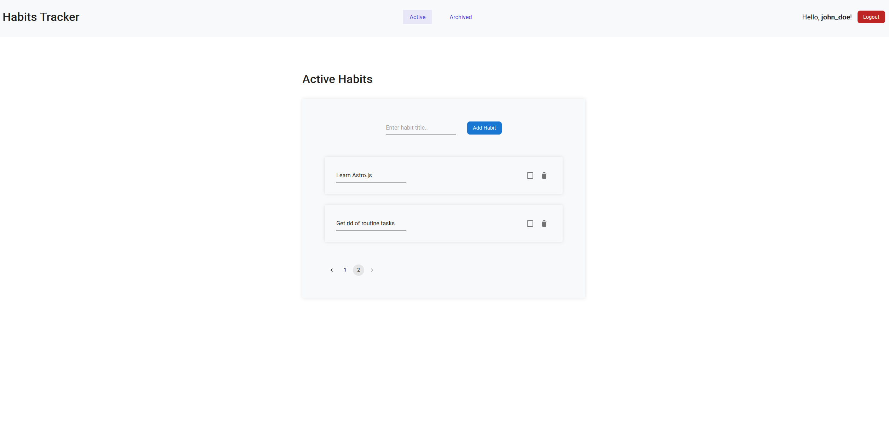

# 📝 Habits Tracker

<p align="center">
  
</p>

## 🚀 Getting Started

Clone the repository and install dependencies:

```sh
# Clone the repo
git clone https://github.com/EcchiGrill/habits-tracker.git
cd habits-tracker

# Install dependencies
yarn install  # or npm install
```

### 💻 Running the App

Start the development server:

```sh
yarn dev  # or npm run dev
```

The app will be available at `http://localhost:5173`.

### 🛠 Running the API

Start the API development server:

```sh
yarn api  # or npm run api
```

The API will be available at `http://localhost:4200`.

---

## 📦 Tech Stack

- ⚫️ **FSD**
- 🔵 **React**
- 🟢 **MUI**
- 🟣 **Zustand**
- 🔴 **JSON Server**
